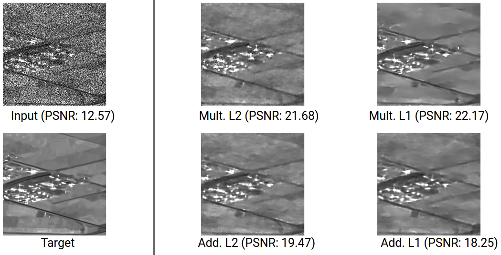

# FFDNet for SAR image despeckling
Repository for the project of the class 'Remote sensing data'. 

Based upon the paper: "Zhang, K., Zuo, W., & Zhang, L. (2018). FFDNet: Toward a fast and flexible solution for CNN-based image denoising" [link](https://arxiv.org/abs/1710.04026).

Code references: The Network blocks and the architecture of the FFDNet are adapted from https://github.com/cszn/KAIR. In the code it is marked what is taken from this reference. Additionally, we used functions (Speckle injection, PSNR calculation) from Mr. Emanuele Dalsasso. (these function parts are also marked in the code)

The project was developed and tested mainly using Google Colab to have GPU support.

For the development of this project we relied on SAR-images of the Image, Data, Signal Department of Telecom Paris that constitutes a part of their ongoing research, which the reason for which we do not publish the data.
